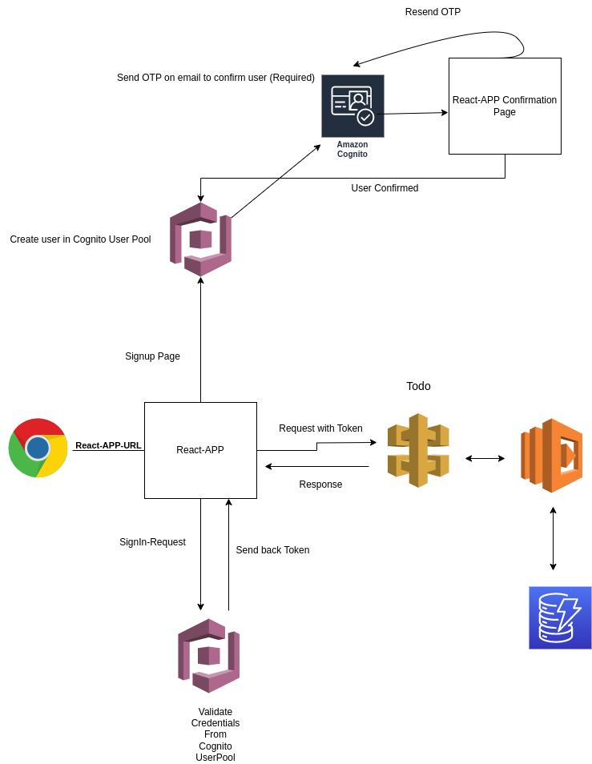

# React App With Authorization And Todo CRUD

## Code Structure

### `src/components`

- `Auth`
  - `AuthContext` (Wraps the entire application)
- `ConfigHandler`
  - `useHandler`
- `Header`
  - `NavBar`
  - `SignInLinks` (when user is signed in)
  - `SignOutLinks`
- `Todo`
  - `Context` (Wraps only the home component where todos are needed)
  - `List` (Gets a list of todos from DynamoDB for the logged-in user)
  - `Add` (Adds a todo for the logged-in user)

### `src` (Application Main Components)

- `Home` (Wrapped with Todo)
- `Confirmation` (User to confirm Cognito user status by OTP)
- `SignIn` (Forwards request to AWS Cognito)
- `SignUp` (Forwards request to AWS Cognito)
- `SecondHome` (Unused component)
- `App.js` (Main component for booting up the application, wrapped with AuthContext and React Routing)

## AWS Services

### API Gateway

To set up API Gateway:

- Create an API resource (similar to the example above)
- Attach your lambda function to it
- Enable CORS
- Optionally, if you are using an Alias for lambda functions, mention it in the integration request tab
- Deploy the API in a new stage (e.g., staging or dev)

### Lambda Function

To set up Lambda function:

- Zip the lambda-dynamodb contents
- Go to the Lambda dashboard in the AWS console
- Upload the zip folder
- Optionally, you can use versioning/Aliases if needed
- Attach an IAM Execution role with read/write access to CloudWatch and DynamoDB

### DynamoDB

To set up DynamoDB:

- Create a table named "Todos" with default configurations

### Cognito

To set up Cognito:

- Create a User Pool with default settings
- Note down the User Pool ID and secret, which will be used in our application

## Services Integration in React App

Now that we have configured our AWS services needed for this project, we need to integrate them with our app.

### Environment Variables

For local development, you can create a `.env` file with the following variables:

REACT_APP_USER_POOL_ID=YOUR_COGNITO_USER_POOL_ID
REACT_APP_CLIENT_ID=YOUR_COGNITO_USER_POOL_SECRET
REACT_APP_API_GATEWAY=YOUR_API_GATEWAY_RESOURCE_URL

### Start Development Server

In the project directory, you can run:

This runs the app in development mode.\
Open [http://localhost:3000](http://localhost:3000) to view it in your browser.
